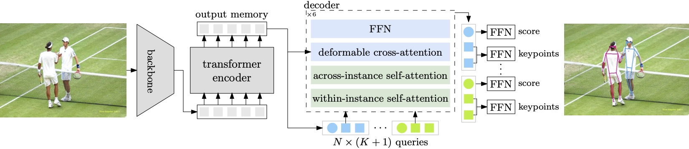

# Group Pose

This repository is an official implementation of the ICCV 2023 paper "[Group Pose: A Simple Baseline for End-to-End Multi-person Pose Estimation]()".

☀️ If you find this work useful for your research, please kindly star our repo and cite our paper! ☀️

### TODO
We are working hard on following items.

- [ ] Release arXiv paper 
- [x] Release [PaddlePaddle scripts](https://github.com/Michel-liu/GroupPose-Paddle)
- [x] Release train&test scripts
- [x] Release checkpoints 

## Introduction

In this paper, we study the end-to-end multi-person pose estimation and present a simple yet effective transformer approach, named Group Pose. **We simply regard $K$-keypoint pose estimation as predicting a set of $N\times K$ keypoint positions, each from a keypoint query, as well as representing each pose with an instance query for scoring $N$ pose predictions.**



Motivated by the intuition that the interaction, among across-instance queries of different types, is not directly helpful, we make a simple modification to decoder self-attention. **We replace single self-attention over all the $N\times(K+1)$ queries with two subsequent group self-attentions: (i) $N$ within-instance self-attention, with each over $K$ keypoint queries and one instance query, and (ii) $(K+1)$ same-type across-instance self-attention, each over $N$ queries of the same type.** The resulting decoder removes the interaction among across-instance type-different queries, easing the optimization and thus improving the performance. Experimental results on MS COCO and CrowdPose show that our approach without human box supervision is superior to previous methods with complex decoders, and even is slightly better than ED-Pose that uses human box supervision.


## Model Zoo

All the checkpoints can be found here([baidu](https://pan.baidu.com/s/1BkFTB2bel_a5n55hd-afQQ?pwd=y5k2) & [onedrive](https://1drv.ms/f/s!Aqkrc9gPuk8jqYQ0pw4QG0PKsmq0EA?e=FeuHwB) & [Google Drive](https://drive.google.com/drive/folders/1exJMkr7j_HbItRM-u7DWT7scx1n4htiF?usp=sharing)).

### Results on MS COCO val2017 set
| Method                             | Backbone  | Loss Type   | AP          | AP<sub>50</sub>   | AP<sub>75</sub>   | AP<sub>M</sub>    | AP<sub>L</sub>    |
|------------------------------------|-----------|--------|-------------|-------------|-------------|-------------|-------------|
| [PETR](http://openaccess.thecvf.com/content/CVPR2022/html/Shi_End-to-End_Multi-Person_Pose_Estimation_With_Transformers_CVPR_2022_paper.html)             | ResNet-50 | HM+KR  | 68.8    |  87.5     | 76.3    | 62.7     |  77.7     |
| [PETR](http://openaccess.thecvf.com/content/CVPR2022/html/Shi_End-to-End_Multi-Person_Pose_Estimation_With_Transformers_CVPR_2022_paper.html)             | Swin-L    | HM+KR  | 73.1     |  90.7     | 80.9    |  67.2     |  81.7     |
| [QueryPose](https://arxiv.org/abs/2212.07855) | ResNet-50 | BR+RLE | 68.7     |  88.6     |  74.4    | 63.8     | 76.5    |
| [QueryPose](https://arxiv.org/abs/2212.07855) | Swin-L    | BR+RLE | 73.3     |  91.3     |  79.5     |  68.5     |  81.2     |
| [ED-Pose](https://arxiv.org/abs/2302.01593)    | ResNet-50 | BR+KR  | 71.6     |  89.6     |  78.1     |  65.9     |  79.8     |
| [ED-Pose](https://arxiv.org/abs/2302.01593)    | Swin-L    | BR+KR  | 74.3    |  91.5     |  81.6     |  68.6     |  82.6     |
| **GroupPose**                          | ResNet-50 | KR     |  72.0     |  89.4     |  79.1     |  66.8     |  79.7     |
| **GroupPose**                          | Swin-T    | KR     |  73.6     |  90.4     |  80.5     |  68.7     |  81.2     |
| **GroupPose**                          | Swin-L    | KR     | **74.8** | **91.6**  | **82.1**  | **69.4**  | **83.0**  |
> HM, BR and KR denote heatmap, human box regression and keypoint regression.


### Results on MS COCO test2017 set
| Method                             | Backbone  | Loss Type   | AP          | AP<sub>50</sub>   | AP<sub>75</sub>   | AP<sub>M</sub>    | AP<sub>L</sub>    |
|------------------------------------|-----------|--------|-------------|-------------|-------------|-------------|-------------|
| [PETR](http://openaccess.thecvf.com/content/CVPR2022/html/Shi_End-to-End_Multi-Person_Pose_Estimation_With_Transformers_CVPR_2022_paper.html)             | ResNet-50 | HM+KR  |  67.6     |  89.8     |  75.3     |  61.6     |  76.0     |
| [PETR](http://openaccess.thecvf.com/content/CVPR2022/html/Shi_End-to-End_Multi-Person_Pose_Estimation_With_Transformers_CVPR_2022_paper.html)             | Swin-L    | HM+KR  |  70.5     |  91.5     |  78.7     |  65.2     |  78.0     |
| [QueryPose](https://arxiv.org/abs/2212.07855) | Swin-L    | BR+RLE |  72.2     |  92.0     |  78.8     |  67.3     |  79.4     |
| [ED-Pose](https://arxiv.org/abs/2302.01593)    | ResNet-50 | BR+KR  |  69.8     |  90.2     |  77.2     |  64.3     |  77.4     |
| [ED-Pose](https://arxiv.org/abs/2302.01593)    | Swin-L    | BR+KR  |  72.7     |  92.3     |  80.9     |  67.6     |  80.0     |
| **GroupPose**                          | ResNet-50 | KR     |  70.2     |  90.5     |  77.8     |  64.7     |  78.0     |
| **GroupPose**                          | Swin-T    | KR     |  72.1     |  91.4     |  79.9     |  66.7     |  79.5     |
| **GroupPose**                          | Swin-L    | KR     | **72.8**  | **92.5**  | **81.0**  | **67.7**  | **80.3**  |


### Results on CrowdPose test set

| Method                             | Loss   | AP          | AP<sub>50</sub>   | AP<sub>75</sub>   | AP<sub>E</sub>    | AP<sub>M</sub>    | AP<sub>H</sub>    |
|------------------------------------|--------|-------------|-------------|-------------|-------------|-------------|-------------|
| [PETR](http://openaccess.thecvf.com/content/CVPR2022/html/Shi_End-to-End_Multi-Person_Pose_Estimation_With_Transformers_CVPR_2022_paper.html)              | HM+KR  |  71.6     |  90.4     |  78.3     |  77.3     |  72.0     |  65.8  |
| [QueryPose](https://arxiv.org/abs/2212.07855) | BR+RLE |  72.7     | **91.7**  |  78.1     |  79.5     |  73.4     |  65.4     |
| [ED-Pose](https://arxiv.org/abs/2302.01593)    | BR+KR  |  73.1     |  90.5     |  79.8     |  80.5     |  73.8     |  63.8     |
| **GroupPose**                          | KR     | **74.1**  |  91.3     | **80.4**  | **80.8**  | **74.7**  |  **66.4**     |
> All methods are with the Swin-L backbone.


## Installation

### Requirements
The code is developed and validated with ```python=3.7.10,pytorch=1.7.1,cuda=11.0```. Higher versions might be as well.


1. Create your own Python environment with [Anaconda](https://www.anaconda.com/download).
```shell
conda create -n grouppose python=3.7.10
```

2. Activate `grouppose` environment and install PyTorch, torchvision, and other Python packages.
```shell
conda activate grouppose
# pytorch, torchvision
conda install pytorch==1.7.1 torchvision==0.8.2 cudatoolkit=11.0 -c pytorch
# others
pip install pycocotools timm termcolor opencv-python addict yapf scipy
```

3. Clone this repo.
```shell
git clone https://github.com/Michel-liu/GroupPose.git
cd GroupPose
```

4. Compile CUDA operators.
```shell
cd models/grouppose/ops
python setup.py build install
# unit test (should see all checking is True)
python test.py
```

5. To evaluate CrowdPose data, you also need to install the `crowdposetools` package following the [crowdpose-api](https://github.com/Jeff-sjtu/CrowdPose/tree/master/crowdpose-api) instruction.

### Data preparation

For **MS COCO** dataset, please download and extract COCO 2017 train and val images with annotations from
[http://cocodataset.org](http://cocodataset.org/#download).
We expect the directory structure to be the following:
```
path/to/coco/
├── annotations/  # annotation json files
|   ├── person_keypoints_train2017.json
|   └── person_keypoints_val2017.json
└── images/
    ├── train2017/    # train images
    └── val2017/      # val images
```

For **CrowdPose** dataset, please download the images and annotations from [CrowdPose Repository](https://github.com/Jeff-sjtu/CrowdPose#dataset).
The directory structure looks like this:
```
path/to/crowdpose/
├── json/  # annotation json files
|   ├── crowdpose_train.json
|   ├── crowdpose_val.json
|   ├── crowdpose_test.json
|   └── crowdpose_trainval.json (generated by util/crowdpose_concat_train_val.py)
└── images/
    ├── 100000.jpg
    ├── 100001.jpg
    ├── 100002.jpg
    ├── ...
```


## Usage

We provide the command to train Group Pose on a single node with 8 gpus.
The training process takes around 40 hours on a single machine with 8 A100 cards.
You are also free to modify the config file `config/grouppose.py` to evaluate different settings.

### Training on MS COCO

- ResNet-50 as backbone.

```bash
python -m torch.distributed.launch \
    --nproc_per_node=8 \
    --master_port 29579 \
    main.py -c config/grouppose.py \
    --coco_path <path/to/coco/> \
    --output_dir <path/to/output>
```

- Swin-T as backbone, you need to first download the [checkpoint](https://github.com/SwinTransformer/storage/releases/download/v1.0.0/swin_tiny_patch4_window7_224.pth) pre-trained on **ImageNet-1K** and save into `<path/to/swin>` folder.

```bash
python -m torch.distributed.launch \
    --nproc_per_node=8 \
    --master_port 29579 \
    main.py -c config/grouppose.py \
    --backbone swin_T_224_1k \
    --swin_pretrain_path <path/to/swin> \
    --coco_path <path/to/coco> \
    --output_dir <path/to/output>
```

- Swin-L as backbone, you need to first download the [checkpoint](https://github.com/SwinTransformer/storage/releases/download/v1.0.0/swin_large_patch4_window12_384_22k.pth) pre-trained on **ImageNet-22K** and save into `<path/to/swin>` folder. Due to the limitation of GPU memory, we put one image on each GPU card (2 nodes total 16 cards).

```bash
python -m torch.distributed.launch \
    --nproc_per_node=8 \
    --master_port 29579 \
    main.py -c config/grouppose.py \
    --backbone swin_L_384_22k \
    --swin_pretrain_path <path/to/swin> \
    --coco_path <path/to/coco> \
    --output_dir <path/to/output> \
    --options batch_size=1
```

### Training on CrowdPose

To train on CrowdPose with Swin-L, please add `--dataset_file=crowdpose` flag to your commands and modify `--coco_path` to your own crowdpose path (also 2 nodes total 16 cards).

```bash
python -m torch.distributed.launch \
    --nproc_per_node=8 \
    --master_port 29579 \
    main.py -c config/grouppose.py \
    --backbone swin_L_384_22k \
    --swin_pretrain_path <path/to/swin> \
    --coco_path <path/to/crowdpose> \
    --output_dir <path/to/output> \
    --dataset_file=crowdpose \
    --options batch_size=1 num_body_points=14 epochs=80 lr_drop=70
```


### Evaluation
You only need to add `--resume <path/to/checkpoint>` and `--eval` flags to the corresponding training command.

* Swin-L backbone on MS COCO.

```bash
python -m torch.distributed.launch \
    --nproc_per_node=8 \
    --master_port 29579 \
    main.py -c config/grouppose.py \
    --backbone swin_L_384_22k \
    --swin_pretrain_path <path/to/swin> \
    --coco_path <path/to/coco> \
    --output_dir <path/to/output> \
    --options batch_size=1 \
    --resume <path/to/checkpoint> \
    --eval
```

* Swin-L backbone on CrowdPose.
```bash
python -m torch.distributed.launch \
    --nproc_per_node=8 \
    --master_port 29579 \
    main.py -c config/grouppose.py \
    --backbone swin_L_384_22k \
    --swin_pretrain_path <path/to/swin> \
    --coco_path <path/to/crowdpose> \
    --output_dir <path/to/output> \
    --dataset_file=crowdpose \
    --options batch_size=1 num_body_points=14 epochs=80 lr_drop=70 \
    --resume <path/to/checkpoint> \
    --eval
```

> Similarly, you can evaluate other training settings.


## License
Group Pose is released under the Apache 2.0 license. Please see the [LICENSE](LICENSE) file for more information.

## Acknowledgement
This project is built on the open source repositories [Deformable DETR](https://github.com/fundamentalvision/Deformable-DETR), [DINO](https://github.com/IDEA-Research/DINO) and [ED-Pose](https://github.com/IDEA-Research/ED-Pose).
Thanks them for their well-organized codes!

## Citation

```bibtex
@inproceedings{liu2023GroupPose,
  title       = {Group Pose: A Simple Baseline for End-to-End Multi-person Pose Estimation},
  author      = {Liu, Huan and Chen, Qiang and Tan, Zichang and Liu, Jiangjiang and Wang, Jian and Su, Xiangbo and Li, Xiaolong and Yao, Kun and Han, Junyu and Ding, Errui and Zhao, Yao and Wang, Jingdong},
  booktitle   = {Proceedings of the IEEE International Conference on Computer Vision (ICCV)},
  year        = {2023}
}
```
